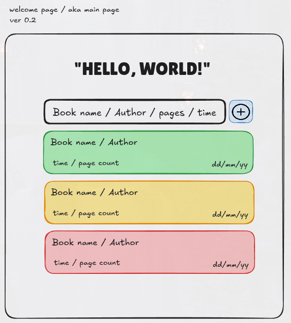

# 🌸 About

I've recently started reading and learning a little about Rust, so I wanted to do some kind of project related to my current interests.

I came up with an idea for a small web app to track my reading. The idea is that I enter a line of text containing the work I've read, following a specific pattern.

Here's a small preview and my rough draft of the home page.

Version 0.1 (excalidraw)


Version 0.2 (excalidraw)



## 🦖 TODO`s

- Edit project tree (reconsider the architecture)
- Design a string parser (think through the main functionality of the site): 
    ```
    // TODO: You can enter from which page to which page you read
    // like 10-23 - This means that you have read 13 pages. 
    //
    // TODO: Also, if you entered an empty time, you can enter a default value based on past readings
    // (you just need to find out how long it takes a person to read 1 page on average)
    // component for text field
    ```

## 🐳 Deploy

For deployment I used the following command: ``` trunk build ```. 
This command created a *docs* folder with files that I moved to a separate created branch.
All command settings are in the file [Trunk.toml](Trunk.toml).
Deployment is performed using GitHub Actions.

The application deployment is implemented in the [main](https://github.com/theun1c/web-basics-rs/tree/main) branch - [docs](https://github.com/theun1c/web-basics-rs/tree/main/docs) folder.

Also available at this [link](https://theun1c.github.io/web-basics-rs/) 

## 🐓 Author

#### still me [theun1c](https://github.com/theun1c) =)

