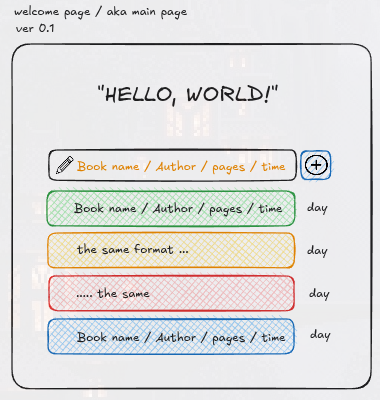

# 🌸 About

I've recently started reading and learning a little about Rust, so I wanted to do some kind of project related to my current interests.

I came up with an idea for a small web app to track my reading. The idea is that I enter a line of text containing the work I've read, following a specific pattern.

Here's a small preview and my rough draft of the home page.



## 🦖 TODO`s

- Edit project tree (reconsider the architecture)
- Implement the visual design of the main page based on the [layout](materials/excalidraw/welcome-page.excalidraw) 
- Design a string parser (think through the main functionality of the site)

## 🐳 Deploy

For deployment I used the following command: ``` trunk build ```. 
This command created a *docs* folder with files that I moved to a separate created branch.
All command settings are in the file [Trunk.toml](Trunk.toml)

The application deployment is implemented in the [main](https://github.com/theun1c/web-basics-rs/tree/main) branch.

Also available at this [link](https://theun1c.github.io/web-basics-rs/) 

## 🐓 Author

### still me [theun1c](https://github.com/theun1c) =)

