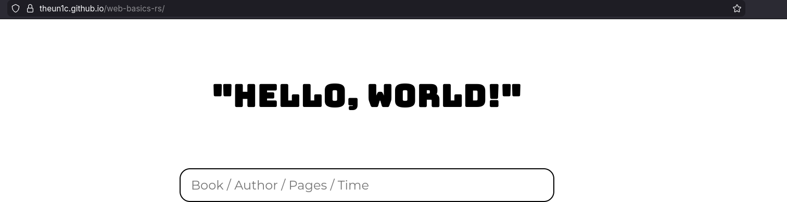

## Пробую верстать главную страницу

За основу и "макет" я взял нарисованный в экскалидров "набросок страницы". 


Мне запала стилистика "рисованной" стрианицы и поэтому, я собираюсь отталккиваться именно от этого дизайна (с линиями черточками разноцветной штриховкой и тд)

Возможно в будущем я пересмотрю это решение, но для первой версии - пойдет.

Для начала следует реализовать самое простое - приветствие. Я хочу оставить его таким банальным, но очень запоминающемся "Hello, World!". 

Мне удалось создать рисованную надпись, но при создании следующих полей "рисованного" поля ввода, мне не удалось добиться нужного мне дизайна, поэтому я хочу пересмотреть свой макет, сделав его проще в плане шрифтов и прчоего UI


Так выглядит главная страница (пока что)

А вот и новая "версия" сайта. Я пересмотрел шрифты и решил сделать что-то более "строгое"



И да, примеры кода: 
Все что нужно на данный момент - это пример компонента и то, как это все выглядит в расте, остальное - верстка 

``` rust
// 
// Component for main title 
#[component]
pub fn MainTitle() -> Html {
    html! {
        <>
            <div class="container">     
                <div class="main-title_text">
                    {"\"Hello, World!\""}
                </div>
            </div>
        </>
    }
}
```

Это работает благодаря yew! 

Еще кстати раньше я все писал в main.rs, но понимал что это овер стремно, поэтому решил использовать какие-то mod непонятные, но о которых все говорят. Пока что импорты в расте выглядят стремно и не понятно зачем это все так усложнено и почему... 

Дикпик вроде как выдал мне более менее нормальный ответ и мне стало чуть понятнее. Продублирую его тут, дабы запомнить 

Правила импорта в Rust: 

Правило 1: Каждая папка - это модуль

В Rust папка сама по себе НЕ является модулем. Нужен файл mod.rs внутри папки.

Правило 2: mod.rs - это "индекс" папки

Файл mod.rs говорит Rust: "В этой папке есть следующие модули".

``` rust
// components/mod.rs
pub mod main_title;  // "В этой папке есть файл main_title.rs"
```

``` rust
// main.rs
mod components;  // "Подключи модуль components"

// Теперь можем использовать
use components::main_title::MainTitle;
```

Почему так сложно? 

Причина 1: Явность лучше неявности

Rust предпочитает явно объявлять зависимости:
``` rust
// Явно говорим, какие модули есть
mod components;    // ← этот файл существует
mod database;      // ← этот файл существует
mod utils;         // ← этот файл существует
```

Причина 2: Контроль над видимостью

Вы сами решаете, что экспортировать:
``` rust
// components/mod.rs
pub mod main_title;     // Доступно снаружи
mod secret_component;   // Только внутри components/
```

Причина 3: Структура проекта = структура кода

Иерархия файлов = иерархия модулей:
``` rust
src/
├── main.rs
└── api/
    ├── mod.rs          // pub mod users;
    └── users.rs        // pub struct User;
```